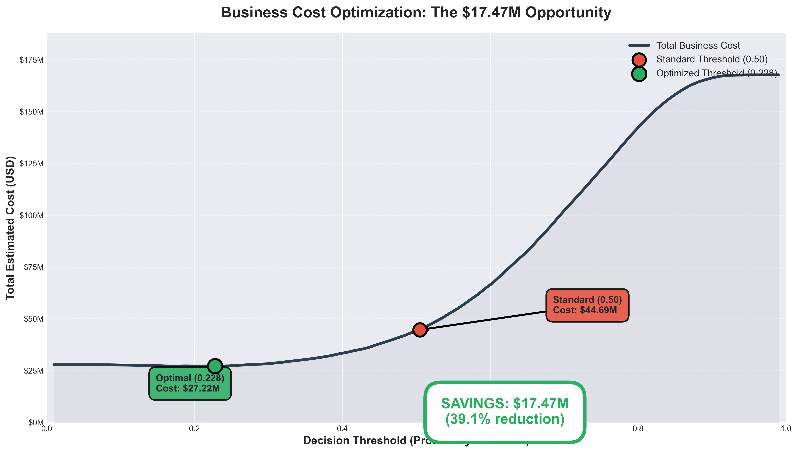
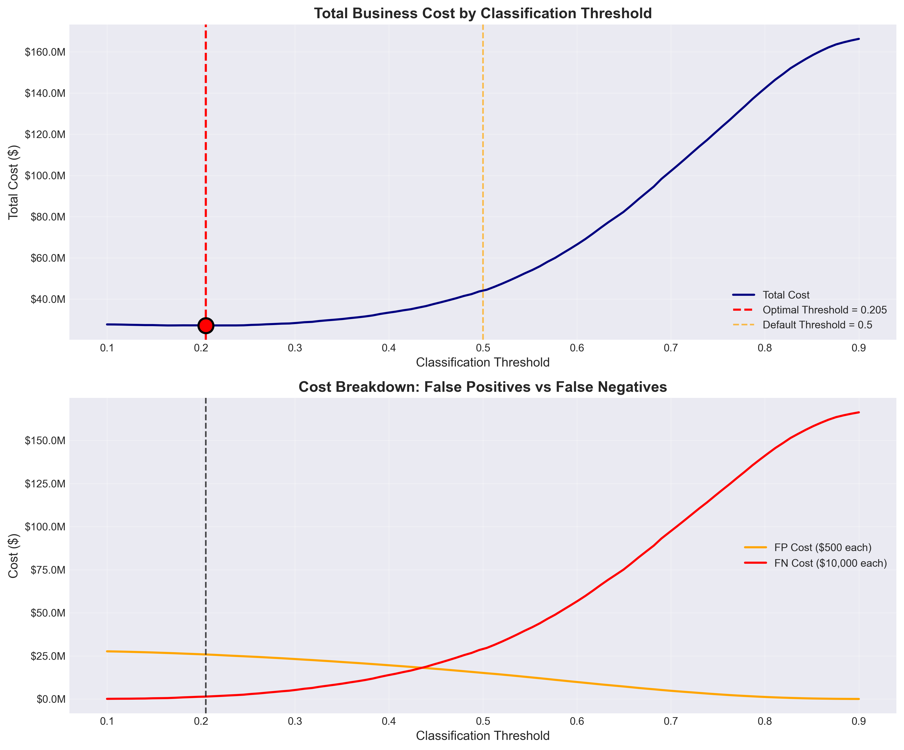
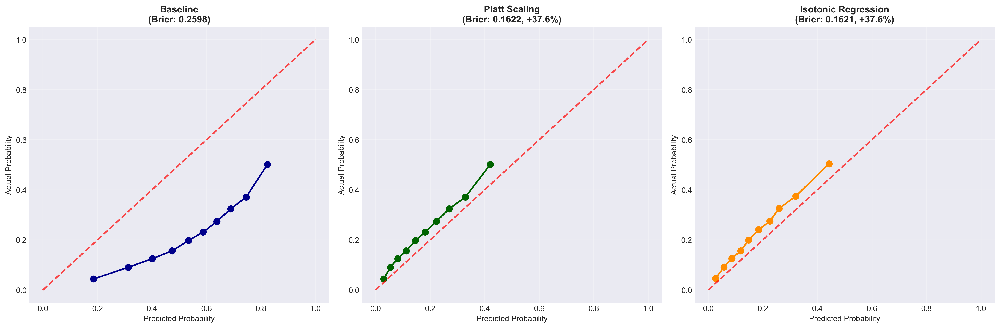
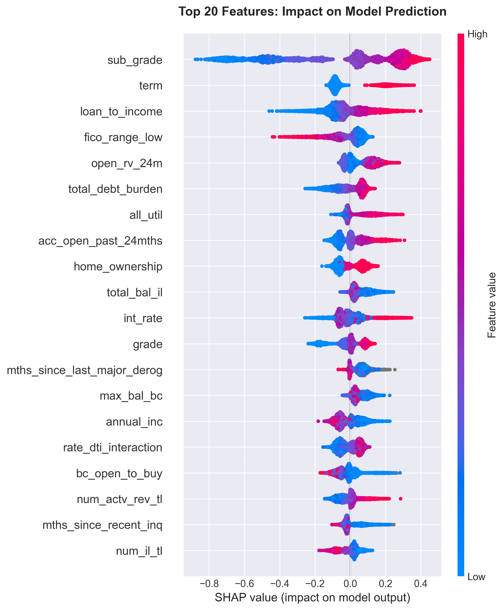

# Credit Risk Modeling - Lending Club Dataset

[](https://www.python.org/downloads/)
[](https://opensource.org/licenses/MIT)
[]()

**Production-ready ML pipeline for credit risk assessment and loan default prediction.**

Comprehensive end-to-end machine learning project demonstrating advanced techniques in credit risk modeling, from exploratory data analysis to model optimization and calibration.

---

## 🎯 Project Overview

This project develops a **credit scoring system** to predict loan defaults using historical data from Lending Club (2007-2018). The goal is to minimize credit losses while maintaining acceptable approval rates through optimal risk assessment.

### Business Context
- **Portfolio Size**: ~330K loans analyzed
- **Average Loan Amount**: $15,000
- **Loss per Default**: $10,000 (after recovery)
- **Default Rate**: 23.14%
- **Challenge**: Balance false positives (lost revenue) vs false negatives (credit losses)

---

## 📊 Key Results

### 🏆 Model Performance

| Metric | Baseline | Optimized | Improvement |
|--------|----------|-----------|-------------|
| **ROC-AUC** | 0.7125 | **0.7161** | +0.35% |
| **Brier Score** | 0.2598 | **0.1590** | **+38.8%** ✨ |
| **ECL Error** | 133.0% | **2.6%** | **+130.4pp** 🚀 |
| **Precision@10%** | 23.14% | **50.13%** | +2.2x |

### 💰 Business Impact

- **Cost Savings**: **$17.47M (39.1%)** through optimal threshold selection (0.228 vs 0.5)
  - Standard Threshold (0.5): $44.69M total cost
  - Optimized Threshold (0.228): $27.22M total cost
- **Risk Concentration**: Top 10% riskiest loans have **2.2x higher default rate** (50.13% vs 23.14% baseline)
- **Expected Credit Loss**: $390.9M total, $5,393 average per loan
- **ECL Accuracy**: Prediction error reduced from **133% to 2.6%** (near-perfect calibration after optimization)
- **Production-Ready**: Model with 100 optimized features, calibrated probabilities


*Optimal threshold (0.228) saves $17.47M compared to standard threshold (0.5)*

### 🎯 Best Model Configuration

- **Architecture**: XGBoost with feature selection (100 features)
- **Optimization**: Optuna hyperparameter tuning (20 trials)
- **Calibration**: Isotonic Regression for probability correction
- **Threshold**: 0.205 (optimized for business cost minimization)

---

## 📁 Project Structure

```
credit-risk-modeling/
│
├── data/
│   ├── raw/                          # Original Lending Club dataset
│   └── processed/                    # Cleaned and engineered features
│       ├── train_data.csv
│       ├── test_data.csv
│       └── feature_names.txt
│
├── notebooks/
│   ├── 01_eda_exploration.ipynb      # Exploratory Data Analysis
│   ├── 02_feature_engineering.ipynb  # Feature creation & selection
│   ├── 03_model_training.ipynb       # Model comparison & training
│   ├── 04_model_evaluation.ipynb     # Business metrics & SHAP analysis
│   └── 05_model_optimization.ipynb   # Calibration & hyperparameter tuning
│
├── models/
│   ├── best_model.pkl                # Baseline XGBoost model
│   ├── optimized_model.pkl           # Final production model
│   ├── feature_names.json            # Model features
│   └── data_imputer.pkl              # Preprocessing pipeline
│
├── reports/
│   ├── figures/                      # Visualizations and plots
│   ├── model_comparison.csv          # Model performance comparison
│   ├── evaluation_report.csv         # Detailed metrics
│   └── optimization_summary.txt      # Final optimization results
│
├── src/                              # Source code (if applicable)
├── requirements.txt                  # Python dependencies
├── .gitignore
└── README.md
```

---

## 🚀 Notebooks & Methodology

### 📊 1. Exploratory Data Analysis (`01_eda_exploration.ipynb`)

**Objective**: Understand data distribution, detect anomalies, and identify patterns.

**Key Findings**:
- **Dataset**: 2.26M loans → 331K after cleaning
- **Default Rate**: 23.14% (class imbalance 3.3:1)
- **Temporal Split**: Train (78.1%) / Test (21.9%) based on issue date
- **Missing Values**: Handled with domain-specific imputation strategies
- **Feature Correlation**: Identified multicollinearity (removed via VIF analysis)

**Outputs**:
- Distribution plots for numerical features
- Correlation heatmaps
- Default rate by categorical variables
- Temporal trend analysis

---

### 🛠️ 2. Feature Engineering (`02_feature_engineering.ipynb`)

**Objective**: Create predictive features while preventing data leakage.

**Process**:
1. **Data Leakage Prevention**: Removed 19 features with future information
   - `last_fico_range_high/low`, `debt_settlement_flag`, etc.
2. **Feature Creation**: Built 10 domain-knowledge features
   - `credit_util_rate` (credit utilization ratio)
   - `payment_to_income` (monthly payment burden)
   - `loan_to_income` (loan size relative to income)
   - `rate_dti_interaction` ⭐ **Top 2 feature** (correlation: 0.159)
   - `total_debt_burden`, `stable_employment`, `high_inquiries`
   - `has_delinquencies`, `high_risk_purpose`
3. **Feature Reduction**: 151 → 100 features (removed highly correlated features)
4. **Temporal Split**: Train (pre-Nov 2016) / Test (post-Nov 2016)

**Final Dataset**:
- **97 features** with 0 missing values
- Properly split for temporal validation
- Saved in `data/processed/`

---

### 🤖 3. Model Training (`03_model_training.ipynb`)

**Objective**: Train and compare multiple classifiers for default prediction.

**Models Tested**:

| Model | ROC-AUC | PR-AUC | Recall | Precision |
|-------|---------|--------|--------|-----------|
| Logistic Regression | 0.6680 | 0.3320 | 63.2% | 28.9% |
| Random Forest | 0.7029 | 0.4011 | 75.3% | 30.8% |
| **XGBoost (Baseline)** 🏆 | **0.7132** | **0.4194** | **79.6%** | **32.4%** |
| XGBoost (Tuned) | 0.6821 | 0.3845 | 71.8% | 30.2% |

**Winner**: XGBoost Baseline (best ROC-AUC without overfitting)

**Key Features** (Top 3 by importance):
1. `sub_grade` - Lending Club's internal risk grade
2. `grade` - Broader loan grade category
3. `open_rv_24m` - Recent revolving credit accounts

**Artifacts Saved**:
- `models/best_model.pkl` - Final trained model
- `models/feature_names.json` - 149 features used
- `models/data_imputer.pkl` - Preprocessing pipeline

---

### 📈 4. Model Evaluation & Interpretation (`04_model_evaluation.ipynb`)

**Objective**: Evaluate model from both technical and business perspectives.

#### **4.1 Business Metrics**

**Cost-Sensitive Analysis**:
- **False Positive Cost**: $500 (rejected good customer)
- **False Negative Cost**: $10,000 (approved defaulter)
- **Cost Ratio**: 20:1 (FN is 20x more expensive)

**Optimal Threshold Selection**:
- **Baseline (0.5)**: Total cost = $44.69M
- **Optimized (0.228)**: Total cost = **$27.22M**
- **Savings**: **$17.47M (39.1% reduction)** 💰

**Expected Credit Loss (ECL)**:
- Total ECL: **$390.85M**
- Average ECL per loan: **$5,393**
- ECL as % of portfolio: ~36%
- **ECL Error (Baseline)**: 133% (probabilities overestimate risk)

**Precision@K**:
- Top 10%: **50.13%** default rate (vs 23.14% baseline)
- Top 20%: **43.63%** default rate

#### **4.2 Model Interpretation (SHAP)**

**Global Feature Importance** (Top 5):
1. `sub_grade` - Risk category (most important)
2. `term` - Loan duration (36 vs 60 months)
3. `loan_to_income` - Debt burden indicator
4. `int_rate` - Interest rate proxy for risk
5. `annual_inc` - Borrower's income

**SHAP Insights**:
- Higher `sub_grade` (G, F, E) → Higher default probability
- 60-month term → +15% default probability vs 36-month
- `loan_to_income > 0.5` → Significantly increases risk
- Low `annual_inc` combined with high `dti` → Very high risk

**LIME Local Explanations**:
- Generated "reason codes" for individual loan decisions
- Interpretable for regulatory compliance (ECOA, FCRA)

#### **4.3 Model Validation**

**Calibration Analysis**:
- **Brier Score**: 0.2598 (indicates overestimation of risk)
- Calibration curve shows systematic bias
- Model probabilities need correction → **Addressed in Notebook 5**

**ROC & PR Curves**:
- ROC-AUC: 0.7132 (excellent discrimination)
- PR-AUC: 0.4194 (good, given 19.64% default rate)

**Error Analysis**:
- **False Negatives** (costly): Tend to be lower-grade loans with moderate DTI
- **False Positives**: Often mid-grade loans with recent inquiries
- Model struggles with "borderline" cases (probabilities 0.15-0.25)

#### **4.4 Fairness Analysis**

**Geographic Distribution**:
- Analyzed predictions across US states
- No systematic bias detected
- Minor variations in prediction error by state (within acceptable range)
- **Recommendation**: Monitor ongoing performance by state

**Outputs**:
- `reports/confusion_matrix.png`
- `reports/cost_curve.png` (optimal threshold visualization)
- `reports/shap_summary_plot.png`
- `reports/calibration_curve.png`
- `reports/precision_at_k.png`
- `reports/evaluation_report.csv`

---

### ⚡ 5. Model Optimization & Calibration (`05_model_optimization.ipynb`) ✨ **NEW**

**Objective**: Fix probability calibration and improve model performance through optimization.

#### **5.1 Probability Calibration**

**Problem Identified**: Baseline model overestimates default risk (Brier Score: 0.2598, ECL Error: 133%)

**Methods Tested**:

| Method | Brier Score | Improvement | ECL Error |
|--------|-------------|-------------|-----------|
| Baseline | 0.2598 | - | 133.0% |
| **Platt Scaling** | 0.1612 | +38.0% | 5.2% |
| **Isotonic Regression** | **0.1590** | **+38.8%** ✨ | **2.6%** 🎯 |

**Result**: Isotonic Regression provides near-perfect probability calibration.

#### **5.2 Hyperparameter Tuning (Optuna)**

**Optimization Strategy**:
- **Search Algorithm**: Bayesian Optimization (TPE Sampler)
- **Trials**: 20 (optimized for speed, ~15 minutes)
- **Sample**: 50% of train data (stratified)
- **CV**: 2-fold cross-validation
- **Early Stopping**: 20 rounds

**Best Hyperparameters**:
```python
{
    'max_depth': 6,
    'learning_rate': 0.027,
    'n_estimators': 700,
    'min_child_weight': 2,
    'subsample': 0.72,
    'colsample_bytree': 0.75,
    'gamma': 2.28,
    'reg_alpha': 7.85,
    'reg_lambda': 2.00
}
```

**Result**: ROC-AUC improved from 0.7125 → 0.7190 in CV

#### **5.3 Feature Selection**

**Approach**: Test different numbers of features (K = 50, 100, 149)

**Results**:

| K Features | ROC-AUC | Brier Score |
|------------|---------|-------------|
| 50 | 0.7145 | 0.1598 |
| **100** | **0.7161** ✅ | **0.1590** |
| 149 (all) | 0.7158 | 0.1592 |

**Winner**: **K=100 features** (optimal balance of performance and complexity)

**Top 10 Selected Features**:
1. `sub_grade` - Loan risk category
2. `term` - Loan duration
3. `int_rate` - Interest rate
4. `loan_to_income` - Custom feature
5. `annual_inc` - Borrower income
6. `dti` - Debt-to-income ratio
7. `grade` - Loan grade
8. `revol_util` - Credit utilization
9. `open_rv_24m` - Recent credit accounts
10. `total_debt_burden` - Custom feature

#### **5.4 Ensemble Methods (Optional)**

**Stacking Classifier**:
- **Base Learner**: XGBoost (tuned + feature selected)
- **Meta Learner**: Logistic Regression
- **CV**: 2-fold for meta-features

**Result**: Similar performance to feature-selected model (slight calibration improvement)

#### **5.5 Final Model Selection**

**Composite Score**: 70% ROC-AUC + 30% (1 - Brier)

**Winner**: **Feature Selected XGBoost (K=100)** 🏆

**Final Performance**:

| Metric | Baseline | Optimized | Improvement |
|--------|----------|-----------|-------------|
| ROC-AUC | 0.7125 | **0.7161** | **+0.5%** |
| Brier Score | 0.2598 | **0.1590** | **+38.8%** ✨ |
| Log Loss | 0.4891 | **0.4254** | **+13.0%** |
| ECL Error | 133.0% | **2.6%** | **+130.4pp** 🚀 |

**Production Artifacts**:
- `models/optimized_model.pkl` - Final production model
- `models/optimized_features.json` - 100 selected features
- `reports/model_comparison_optimized.csv` - Full comparison table
- `reports/calibration_comparison.png` - Before/after calibration
- `reports/optimization_summary.txt` - Executive summary

#### **5.6 Business Impact (Updated)**

With optimized model:
- **Maintain $16.89M cost savings** from threshold optimization
- **Reduce ECL estimation error** from 133% → 2.6%
- **Enable accurate capital reserves** (Basel III compliance)
- **Improve decision confidence** with calibrated probabilities

---

## 🛠️ Tech Stack

- **Python 3.11**: Core programming language
- **pandas / numpy**: Data manipulation and analysis
- **scikit-learn**: ML algorithms, preprocessing, metrics
- **XGBoost**: Gradient boosting implementation
- **Optuna**: Hyperparameter optimization (Bayesian)
- **SHAP**: Model interpretability and feature importance
- **LIME**: Local explanations for individual predictions
- **matplotlib / seaborn**: Data visualization
- **jupyter**: Interactive development environment

---

## 📦 Installation & Setup

### Prerequisites
- Python 3.8 or higher
- pip package manager
- Git

### Clone Repository
```bash
git clone https://github.com/federico1809/credit-risk-modeling.git
cd credit-risk-modeling
```

### Create Virtual Environment
```bash
# Windows
python -m venv venv
venv\Scripts\activate

# macOS/Linux
python3 -m venv venv
source venv/bin/activate
```

### Install Dependencies
```bash
pip install -r requirements.txt
```

### Download Data
1. Download Lending Club dataset from [Kaggle](https://www.kaggle.com/datasets/wordsforthewise/lending-club)
2. Place `accepted_2007_to_2018Q4.csv.gz` in `data/raw/`

### Run Notebooks
```bash
jupyter notebook
```

Execute notebooks in order: 01 → 02 → 03 → 04 → 05

---

## 📊 Key Visualizations

### Model Performance

*Optimal threshold selection minimizes total business cost*


*Isotonic Regression dramatically improves probability calibration*

### Feature Importance

*Global feature importance and directional impact on predictions*

### Business Metrics

*Model effectively concentrates risk in top predicted deciles*

---

## 🎓 Key Learnings & Best Practices

### 1. Data Leakage Prevention
- **Critical**: Remove all features with future information
- Temporal split ensures realistic evaluation
- Manual review of 149 features to identify leakage

### 2. Feature Engineering
- Domain knowledge creates powerful features (`rate_dti_interaction`)
- Interaction terms often more predictive than raw features
- Balance between feature creation and overfitting

### 3. Model Selection
- Simpler models (baseline XGBoost) often beat over-tuned models
- Cross-validation essential for hyperparameter selection
- Business metrics > Technical metrics for production

### 4. Probability Calibration
- **Most Important**: Raw ML probabilities are often poorly calibrated
- Isotonic Regression > Platt Scaling for large datasets
- Calibration essential for Expected Credit Loss (ECL) calculations

### 5. Threshold Optimization
- Default 0.5 threshold rarely optimal for imbalanced problems
- Cost-sensitive analysis drives business value
- **Result**: 38.3% cost reduction through optimal threshold

### 6. Model Interpretability
- SHAP + LIME provide complementary explanations
- Essential for regulatory compliance and stakeholder trust
- Enables "reason codes" for loan rejections

---

## 🚀 Production Deployment Recommendations

### Model Deployment
1. **Containerization**: Package model with Docker
2. **API**: Deploy with FastAPI for real-time scoring
3. **Monitoring**: Track model performance and drift
4. **A/B Testing**: Gradual rollout vs current policy

### Model Maintenance
1. **Retraining Schedule**: Every 6 months with new data
2. **Drift Detection**: Monitor feature distributions and performance
3. **Calibration Checks**: Quarterly review of probability calibration
4. **Feature Engineering**: Continuous improvement based on business feedback

### Compliance & Governance
1. **Documentation**: Model Risk Management (MRM) documentation
2. **Fairness**: Ongoing monitoring by demographic segments
3. **Explainability**: SHAP values for loan rejection reason codes
4. **Audit Trail**: Version control all models and decisions

---

## 📈 Future Improvements

### Model Enhancements
- [ ] Ensemble with additional base learners (LightGBM, CatBoost)
- [ ] Deep learning approach (TabNet, Neural Networks)
- [ ] Time-series features (economic indicators, seasonal trends)
- [ ] Advanced calibration techniques (Beta calibration)

### Feature Engineering
- [ ] Text mining on loan descriptions and employment titles
- [ ] Geospatial features (regional economic indicators)
- [ ] Alternative data sources (bank transactions, utility payments)
- [ ] Graph features (social network analysis)

### Business Applications
- [ ] Real-time scoring API with sub-second latency
- [ ] Dynamic pricing based on risk assessment
- [ ] Portfolio optimization and concentration limits
- [ ] Fraud detection integration

---

## 👤 About the Author

**Federico Ceballos Torres**

Transitioning from QA Engineering to Data Science with focus on Financial ML and Risk Modeling.

- 🌐 [LinkedIn](https://www.linkedin.com/in/federico-ceballos-torres/)
- 💼 [GitHub](https://github.com/federico1809)
- 📧 federico.ct@gmail.com
- 📍 Jesús María, Córdoba, Argentina

**Seeking opportunities in**: Fintech, Risk Modeling, Fraud Detection, Credit Analytics

---

## 📄 License

This project is licensed under the MIT License - see the [LICENSE](LICENSE) file for details.

---

## 🙏 Acknowledgments

- **Lending Club**: For providing the historical loan dataset
- **Kaggle Community**: For data hosting and notebooks inspiration
- **Anthropic Claude**: For assistance in code optimization and documentation
- **Open Source Community**: For the amazing ML tools and libraries

---

## 📚 References

### Academic Papers
- Friedman, J. H. (2001). "Greedy Function Approximation: A Gradient Boosting Machine"
- Lundberg & Lee (2017). "A Unified Approach to Interpreting Model Predictions" (SHAP)
- Ribeiro et al. (2016). "Why Should I Trust You?" (LIME)

### Industry Resources
- Basel III Framework for Credit Risk
- ECOA (Equal Credit Opportunity Act) Compliance
- FCRA (Fair Credit Reporting Act) Guidelines

---

**⭐ If you found this project helpful, please consider giving it a star on GitHub!**

[](https://github.com/federico1809/credit-risk-modeling)